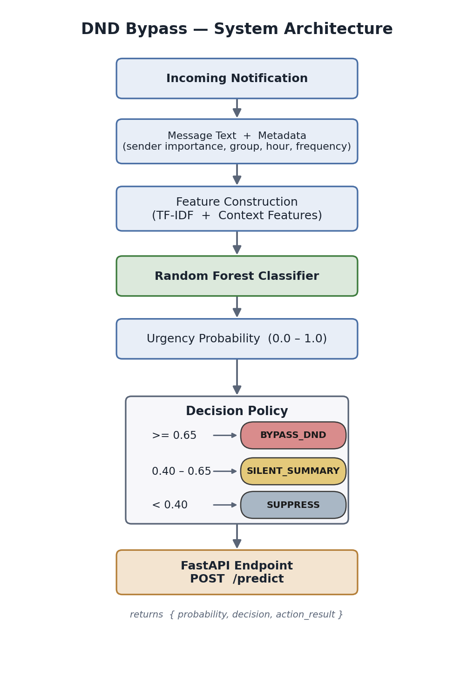
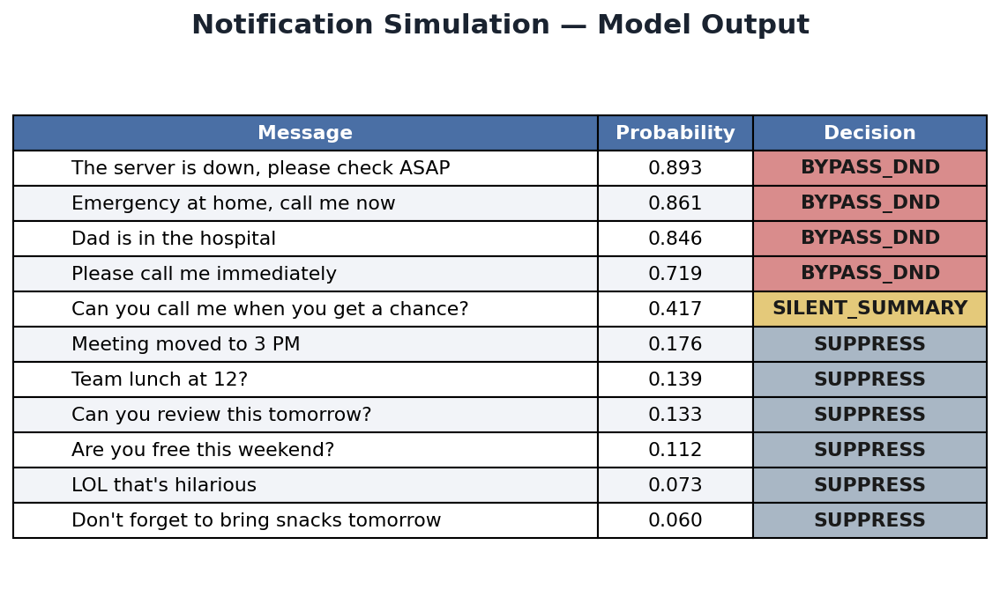
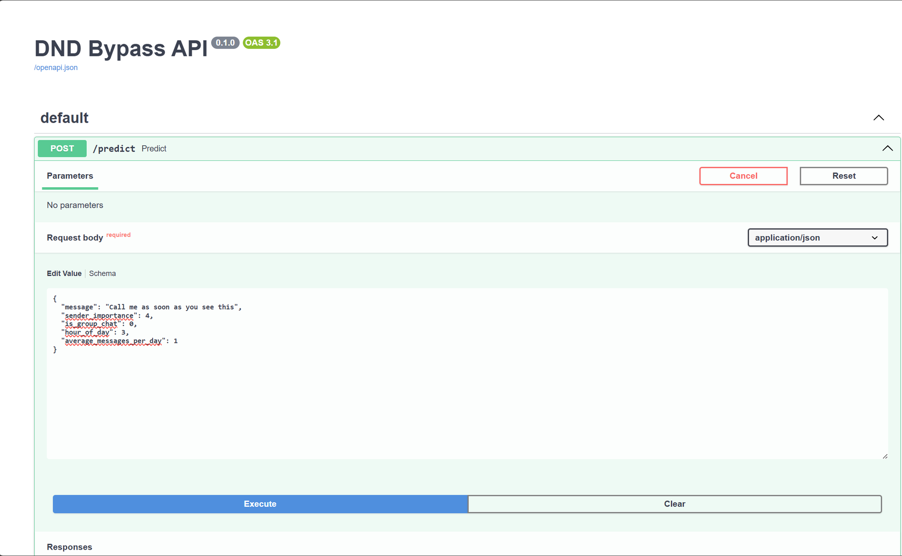

# Context-Aware Notification Prioritization System

A machine learning system that decides whether a notification should interrupt
**Do Not Disturb (DND)** mode — based on what a message *says* and the *context*
it arrives in, rather than how *often* a sender messages.



---

## Project Overview

Modern smartphones receive hundreds of notifications every day. Existing Do Not
Disturb systems often rely on heuristics such as repeated calls, allowlists, or
user-defined priority contacts rather than understanding the semantic content of a
message. As a result, they often fail to distinguish between genuinely urgent
messages and high-frequency but low-priority notifications.

This project introduces a **Context-Aware Notification Prioritization System**
that combines Natural Language Processing (NLP) with contextual metadata to
determine whether a notification should bypass Do Not Disturb mode.

The system analyzes both **message content** and **contextual information** —
sender importance, chat type, message frequency, and time of day — to make
intelligent notification routing decisions.

---

## Skills Demonstrated

- Natural Language Processing (TF-IDF, text classification)
- Feature Engineering
- Imbalanced Classification
- Model Evaluation and Error Analysis
- Random Forest and Logistic Regression
- API Development with FastAPI
- Data Cleaning and Anonymization
- End-to-End ML System Design

---

## Problem Statement

Current notification systems lack semantic understanding of message content. As a
result:

* Important low-frequency messages may be missed.
* High-frequency group chats can incorrectly bypass DND.
* Notification systems cannot adapt to the actual urgency of a message.

The objective of this project is to build a machine learning system capable of
predicting whether a notification should interrupt the user during Do Not Disturb
mode, routing each message to one of three actions:

| Decision | Meaning |
|---|---|
| **BYPASS_DND** | Genuinely urgent — interrupt the user immediately. |
| **SILENT_SUMMARY** | Possibly relevant — hold for a batched, silent summary. |
| **SUPPRESS** | Low priority — keep silent until the user checks manually. |

---

## Dataset Creation

No public dataset exists for this problem, so a custom dataset was built from
real, exported chat history and engineered contextual features.

**Pipeline:**

1. **Source** — ~85k messages exported from personal WhatsApp chats.
2. **Anonymize** — sender names replaced with pseudonyms (`Person_1` … `Person_N`).
3. **Clean & sample** — junk/empty rows removed, then sampled down to a labeled
   working set of ~500 messages.
4. **Label** — each message labeled `1` (urgent / would justify interrupting DND),
   `0` (non-urgent), or `-1` (non-English / content-free, later excluded).
5. **Augment** — because genuinely urgent messages are rare, the corpus was
   augmented with synthetic urgent messages and five synthetic group-chat senders
   (`group_1` … `group_5`) to expose the model to group-chat behavior.

Each record contains:

* Message text
* Sender importance (1–5)
* Group vs. personal chat indicator
* Hour of day
* Average message frequency
* Urgency label

The final labeled working set (`data/chats_sample_features.csv`) contains **454
rows after removing label `-1`**, of which **~8% are urgent** — a deliberately
imbalanced, real-world-like distribution.

> **Note on scale:** This is an intentionally small first iteration. The honest
> limiting factor is the number of *real* urgent examples, not the total record
> count — see [Future Improvements](#future-improvements).

---

## Exploratory Data Analysis

Key findings from EDA on the labeled sample:

* **Sender identity is a strong signal.** Mean `sender_importance` is **3.74** for
  urgent messages vs. **1.99** for non-urgent.
* **Group vs. personal matters.** Group chats are a moderate signal for routing.
* **Time-of-day and frequency are weak in isolation** but expected to add value in
  combination with text and sender features.
* **Text alone is insufficient.** Urgency is often communicated *implicitly*
  (short, context-dependent messages), which motivated the hybrid text + metadata
  approach.

See `notebooks/DND_Bypass_EDA.ipynb` and `project_updates/eda.md`.

---

## Modeling Approach

The project was developed in stages to measure the impact of contextual
information on notification prioritization.

### Baseline Model

* TF-IDF vectorization (`stop_words='english'`, `max_features=3000`)
* Logistic Regression (`class_weight='balanced'`)
* **Message text only**

This established a benchmark for whether contextual metadata adds predictive value.

### Contextual Features

Four metadata features were engineered and combined with the TF-IDF text vector
via `scipy.sparse.hstack` into a hybrid **454 × 736** feature matrix:

* `sender_importance`
* `is_group_chat`
* `hour_of_day`
* `average_messages_per_day`

### Hybrid Models

Two hybrid models were evaluated on the same feature matrix and the same
stratified 80/20 split (`random_state=42`):

1. **Logistic Regression** with text + metadata
2. **Random Forest** with text + metadata
   (`n_estimators=200, max_depth=20, class_weight='balanced'`)

The **Random Forest** achieved the best performance and was selected as the
production model. It estimates an urgency probability that is consumed by the
decision engine.

---

## Results

Three models were evaluated during development. Metrics below are for the
**urgent class (label 1)**.

| Model | Precision | Recall | F1 Score | Accuracy |
| --- | --- | --- | --- | --- |
| Baseline Logistic Regression (Text Only) | 0.40 | 0.57 | 0.47 | 0.895 |
| Hybrid Logistic Regression (Text + Metadata) | 0.83 | 0.62 | 0.71 | 0.96 |
| Hybrid Random Forest (Text + Metadata) | **0.86** | **0.75** | **0.80** | **0.97** |

### Key Findings

* The text-only baseline showed that message content carries useful signal but
  struggles to reliably identify urgent notifications (F1 0.47).
* Adding contextual metadata produced the largest single jump — Hybrid LR lifted
  F1 to 0.71, mostly by collapsing false positives.
* The Random Forest captured non-linear interactions between text, sender, timing,
  and behavior, lifting **recall 0.62 → 0.75** with **no increase in false
  positives** (the cleanest controlled comparison, since LR and RF share an
  identical split).

Compared to the text-only baseline, recall improved from 0.57 to 0.75, reducing
the likelihood of missing genuinely urgent messages.

### Limitations

To keep these numbers defensible:

* The **baseline is not on the same dataset/split** as the hybrid models (it
  predates the synthetic group senders), so "baseline → RF" mixes several changes.
  The fully controlled comparison is **Hybrid LR vs. Hybrid RF**.
* Metrics come from a **single small held-out test set** (8 urgent messages) and
  decision thresholds were tuned on the labeled set the model was trained on.
  Proper held-out / cross-validated evaluation is the top priority before scaling
  (see below).
* `sender_importance` is the dominant feature and is partly human-derived;
  auditing it for leakage is on the roadmap.

---

## Decision Engine

The trained classifier is wrapped in a two-stage decision engine
(`app/predictor.py`):

1. **`score_message(...)`** — reconstructs the 1 × 736 hybrid TF-IDF + metadata row
   at inference time and returns the Random Forest's `predict_proba` for the urgent
   class.
2. **`notification_action(prob)`** — maps the probability to an action using
   empirically tuned thresholds:

   | Probability | Decision |
   |---|---|
   | `>= 0.65` | **BYPASS_DND** |
   | `0.40 – 0.65` | **SILENT_SUMMARY** |
   | `< 0.40` | **SUPPRESS** |

3. **`process_notification(...)`** — runs scoring → decision → action routing and
   returns the full result.

A representative example of the contextual behavior the system is designed to
show:

| Message | Probability | Decision |
|---|---|---|
| "Please call me immediately" | 0.719 | BYPASS_DND |
| "Can you call me when you get a chance?" | 0.417 | SILENT_SUMMARY |

Same intent, different urgency — distinguished by content, not frequency.

Running the full simulation across a set of representative messages produces:



---

## API Deployment

The decision engine is served via **FastAPI** (`app/main.py`), exposing a single
`POST /predict` endpoint with auto-generated interactive docs at `/docs`.



**Request:**

```json
{
  "message": "Dad is in the hospital",
  "sender_importance": 5,
  "is_group_chat": 0,
  "hour_of_day": 23,
  "average_messages_per_day": 1
}
```

**Response:**

```json
{
  "message": "Dad is in the hospital",
  "probability": 0.786,
  "decision": "BYPASS_DND",
  "action_result": {
    "action": "BYPASS_DND",
    "result": "Notification delivered: Dad is in the hospital"
  }
}
```

---

## System Architecture

```
Incoming Notification
        │
        ▼
Message Text + Metadata
        │
        ▼
Feature Construction (TF-IDF + Context Features)
        │
        ▼
Random Forest Classifier
        │
        ▼
Urgency Probability (0.0 – 1.0)
        │
        ▼
Decision Policy
  ├─ >= 0.65      → BYPASS_DND
  ├─ 0.40 – 0.65  → SILENT_SUMMARY
  └─ < 0.40       → SUPPRESS
        │
        ▼
FastAPI Endpoint  POST /predict
```

---

## Future Improvements

* **Rigorous evaluation** — replace the single train-tuned test set with a
  held-out test set and k-fold cross-validation; report AUPRC (the most honest
  metric on imbalanced data) for *all* models, not just the baseline.
* **Scale the dataset** — grow to the full ~20–30k real messages, with a focus on
  collecting more *real* urgent examples (the binding constraint), using weak
  supervision / active labeling to make labeling at that scale tractable.
* **Audit `sender_importance`** — verify it isn't leaking the label, using a
  cross-validated importance score.
* **On-device deployment** — convert the model (e.g. to ONNX/TFLite) for offline,
  low-latency inference on a phone.
* **Android prototype** — Android's `NotificationListenerService` + DND-policy
  access genuinely allow a third-party app to read incoming notifications and gate
  them by content (unlike iOS, which sandboxes this). The FastAPI service is
  designed to act as the backend for such a client.
* **Robust API validation** — replace the raw `dict` payload with a Pydantic model
  so `/predict` returns clean `422` validation errors and typed fields in `/docs`.

---

## Repository Structure

```
DND_Bypass/
├── app/
│   ├── predictor.py        # model loading, scoring, decision policy, routing
│   └── main.py             # FastAPI app exposing POST /predict
├── models/
│   ├── dnd_rf_model.pkl    # trained Random Forest
│   ├── dnd_vectorizer.pkl  # fitted TF-IDF vectorizer
│   ├── dnd_df.pkl
│   └── metadata_features.pkl
├── notebooks/
│   ├── DND_Bypass_EDA.ipynb
│   ├── DND_Bypass_BaselineModel.ipynb
│   ├── DND_Bypass_ContextualFeatureEngineering.ipynb
│   ├── DND_Bypass_DecisionEngine.ipynb
│   └── DND_Bypass_NotificationSimulation.ipynb
├── tests/
│   └── test_predictor.py   # 31 tests incl. notebook-parity regression
├── images/
│   ├── architecture.png
│   ├── api_docs.png        # FastAPI /docs screenshot
│   ├── simulation_output.png
│   ├── make_architecture.py
│   └── make_simulation_table.py
├── data/                   # datasets — git-ignored (contains private chat data)
├── src/                    # data prep + scrub_vectorizer.py (PII removal)
├── project_updates/        # per-milestone write-ups
├── project_log.md          # chronological project log
├── requirements.txt
├── requirements-dev.txt
└── README.md
```

---

## How to Run

### 1. Set up the environment

```bash
python -m venv .venv
# Windows
.\.venv\Scripts\activate
# macOS / Linux
source .venv/bin/activate

pip install -r requirements.txt
```

> scikit-learn is pinned to **1.6.1** in `requirements.txt` because the saved
> model pickles require it to load.

### 2. Run the predictor standalone

```bash
python app/predictor.py
```

Prints a sample prediction for `"Dad is in the hospital"`.

### 3. Run the API

```bash
# from the repo root
uvicorn app.main:app --reload
```

Then open **http://127.0.0.1:8000/docs** and try `POST /predict`.

### 4. Run the tests

```bash
pip install -r requirements-dev.txt
pytest tests/ -v
```

The suite includes a regression test that replays the notebook's 11-message
simulation through `predictor.py` and asserts the probabilities match to 3
decimals.

---

## Conclusion

This project demonstrates that notification prioritization benefits from combining
**message semantics with contextual metadata** rather than relying on text — or
message frequency — alone. A hybrid Random Forest improved urgent-message recall
from 0.57 (text-only baseline) to 0.75 while keeping false positives low, and the
full pipeline was packaged into a deployable FastAPI service with a clear
three-tier decision policy.

The work is an early but end-to-end prototype: from self-collected data through
modeling, a decision engine, and a served API. The clear next steps — rigorous
held-out evaluation, scaling to more real urgent examples, and an on-device
Android implementation — are what would turn this proof-of-concept into a usable
intelligent-notification product.
